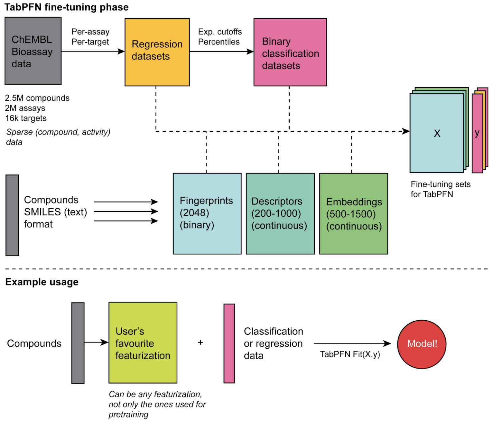

# ChEMBL tasks for fine-tuning

Extract tasks from ChEMBL for model fine-tuning.

## Background

This repository contains code to extract **classification** and **regression** tasks from ChEMBL. The ultimate goal is to use these tasks to fine-tune the [TabPFN model](https://www.nature.com/articles/s41586-024-08328-6).



We offer a simple API to iterate over ChEMBL data and produce train, validation and test splits. All datasets are single tasks and are either binary classifications or regressions. As chemical featurizers, we use Morgan count fingerprints (radius 3, 2048 bits), MACCS keys (166 bits) and RDKIT physicochemical descriptors (200 dimensions).

Note that train, validation and tests splits are done at the target level, ensuring that no target in the validation or test splits is represented in the training set.

## Get the necessary data

You can download the `processed` folder from [here](https://example.com). Unzip the file and place the `processed` folder in the root of the current directory.

Alternatively, you can produce the `processed` data yourself by running, sequentially, all scripts from the `scripts` subfolder.

## Set up

Set up an environment using Conda:

```bash
conda create -n chembltasks python=3.12
conda activate chembltasks
```

Install the `chembltasks` Python package:

```bash
cd chembl-tasks-for-finetuning
pip install -e .
```

## Usage

This is a very simple package, containing only one class with one method (iterator). The goal is to iterate over classification and regression tasks available from the `processed` folder.

For now, we have bare-minimum functionality. Below are the relevant variables for the package:

| Parameter            | Type | Default Value                        | Allowed Values         | Description                                                                                                                     |
|----------------------|------|--------------------------------------|------------------------|---------------------------------------------------------------------------------------------------------------------------------|
| `processed_data_dir` | str  | *Root of the current directory*      | N/A                    | Directory where the processed data is stored. If set to None, the default directory is the root of the current directory.       |
| `tasks_per_target`   | int  | 10                                   | 1, 10, 100             | Number of tasks per target. Must be one of [1, 10, 100].                                                                        |
| `num_descriptors`    | int  | 1                                    | 1, 3                   | Number of descriptors. If set to 1, only Morgan fingerprints are used. If set to 3, RDKit physicochemical descriptors and MACCS keys are used in addition to Morgan fingerprints. |
| `round`              | int  | 0                                    | 0, 1, 2                | Round number. Must be in the set [0, 1, 2]. Rounds are simply different random starts.                                                                                       |
| `split`              | str  | N/A                                  | train, valid, test     | The dataset split to iterate over. Must be one of train, valid, test.                                                           |

You can use the package as follows to obtain `X` and `y` matrices for fine-tuning.

```python
from chembltasks import ChemblTasks

ct = ChemblTasks(tasks_per_target=10, num_descriptors=1, round=0)
for data in ct.iterate(split="train"):
    X = data["X"] # feature matrix
    y = data["y"] # output array
    task_type = data["task_type"] # classification or regression
    task = data["task"] # name of the task
```

## Statistics

Here are the number of tasks available for each parameter configuration. Note that we have done a simple baseline performance estimation that we use to get rid of tasks with no "chemical signal". We have imposed soft dropout cutoffs of AUROC < 0.6 for classification tasks and Pearson's rho < 0.2 for regression tasks in 5-fold CV with a random forest (10 trees, default Sklearn parameters) based on Morgan count fingerprints (radius 3, 2048 bits).

| Round | Tasks per Target | Num Descriptors | Train  | Valid | Test  |
|-------|-----------------|----------------|--------|-------|-------|
| 0     | 1               | 1              | 3027   | 382   | 378   |
| 0     | 1               | 3              | 2979   | 384   | 378   |
| 0     | 10              | 1              | 24494  | 3129  | 3075  |
| 0     | 10              | 3              | 29170  | 3667  | 3625  |
| 0     | 100             | 1              | 63025  | 8553  | 8159  |
| 0     | 100             | 3              | 136425 | 18038 | 17369 |
|-------|-----------------|----------------|--------|-------|-------|
| 1     | 1               | 1              | 2972   | 383   | 368   |
| 1     | 1               | 3              | 3011   | 385   | 378   |
| 1     | 10              | 1              | 24622  | 3103  | 3075  |
| 1     | 10              | 3              | 29088  | 3638  | 3684  |
| 1     | 100             | 1              | 64262  | 7315  | 8176  |
| 1     | 100             | 3              | 137813 | 16828 | 17137 |
|-------|-----------------|----------------|--------|-------|-------|
| 2     | 1               | 1              | 2988   | 370   | 379   |
| 2     | 1               | 3              | 3012   | 362   | 374   |
| 2     | 10              | 1              | 24595  | 3194  | 3010  |
| 2     | 10              | 3              | 29231  | 3720  | 3630  |
| 2     | 100             | 1              | 64931  | 7206  | 7591  |
| 2     | 100             | 3              | 138414 | 16941 | 16584 |

